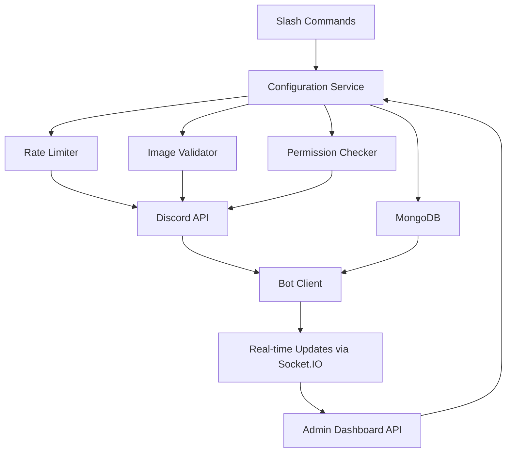
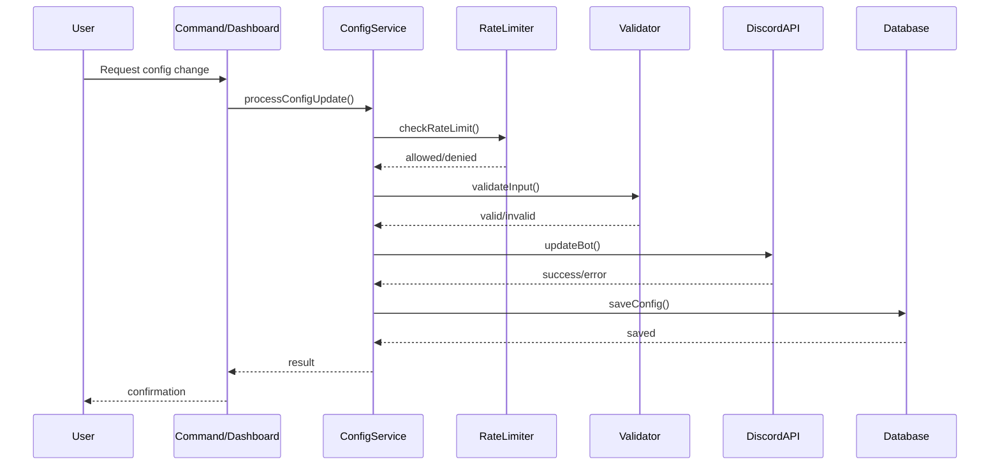

# Design Document: Bot Configuration System

## Overview

The Bot Configuration System enables real-time modification of Discord bot appearance and presence without requiring restarts. This system provides both slash command and web dashboard interfaces for changing bot username, avatar, banner, and presence status. The design emphasizes Discord API rate limit compliance, permission validation, and persistent storage using MongoDB.

## Architecture



## Main Workflow



## Components and Interfaces

### Component 1: Configuration Service

**Purpose**: Central service for managing all bot configuration changes

**Interface**:
```javascript
class BotConfigService {
  async updatePresence(config)
  async updateAvatar(imageUrl)
  async updateUsername(newName)
  async updateBanner(imageUrl)
  async getConfig(guildId)
  async validatePermissions(userId)
}
```

**Responsibilities**:
- Coordinate all configuration updates
- Enforce rate limits before Discord API calls
- Validate inputs before processing
- Persist configuration to database
- Emit real-time updates via Socket.IO

### Component 2: Rate Limiter

**Purpose**: Prevent Discord API rate limit violations

**Interface**:
```javascript
class RateLimiter {
  checkLimit(operation, userId)
  recordOperation(operation, userId)
  getRemainingAttempts(operation, userId)
  resetLimits()
}
```

**Responsibilities**:
- Track API call frequency per operation type
- Enforce cooldown periods (username: 2/hour, avatar: 2/hour, banner: 2/hour)
- Return clear error messages when limits exceeded
- Store rate limit state in memory with Redis fallback option

### Component 3: Image Validator

**Purpose**: Validate images before uploading to Discord

**Interface**:
```javascript
class ImageValidator {
  async validateImage(imageUrl)
  async checkFileSize(imageUrl)
  async checkFormat(imageUrl)
  async downloadAndBuffer(imageUrl)
}
```

**Responsibilities**:
- Validate image format (PNG, JPG, GIF, WebP)
- Check file size limits (avatar: 8MB, banner: 8MB)
- Verify image dimensions (avatar: min 128x128, banner: min 600x240)
- Download and buffer images for Discord API

### Component 4: Permission Checker

**Purpose**: Verify user authorization for configuration changes

**Interface**:
```javascript
class PermissionChecker {
  async isOwner(userId)
  async isAdmin(userId, guildId)
  async canModifyConfig(userId, operation)
}
```

**Responsibilities**:
- Check if user is bot owner (from environment variable)
- Verify admin permissions for guild-specific changes
- Return detailed permission denial reasons

### Component 5: Slash Command Handler

**Purpose**: Provide `/botconfig` command interface

**Interface**:
```javascript
// Command structure
/botconfig presence [status] [type] [activity]
/botconfig avatar [image_url]
/botconfig username [new_name]
/botconfig banner [image_url]
/botconfig view
```

**Responsibilities**:
- Parse command options
- Validate inputs at command level
- Call ConfigService methods
- Provide user-friendly responses with embeds

### Component 6: Dashboard API Endpoints

**Purpose**: Provide REST API for web dashboard

**Interface**:
```javascript
// API Routes
GET    /api/bot-config
POST   /api/bot-config/presence
POST   /api/bot-config/avatar
POST   /api/bot-config/username
POST   /api/bot-config/banner
GET    /api/bot-config/rate-limits
```

**Responsibilities**:
- Authenticate requests using existing auth middleware
- Accept configuration changes from dashboard
- Return current configuration state
- Provide rate limit status information

## Data Models

### Model 1: BotConfigSchema

```javascript
const botConfigSchema = new Schema({
  botId: {
    type: String,
    required: true,
    unique: true,
    index: true
  },
  presence: {
    status: {
      type: String,
      enum: ['online', 'idle', 'dnd', 'invisible'],
      default: 'online'
    },
    activities: [{
      type: {
        type: Number,
        enum: [0, 1, 2, 3, 4, 5], // Playing, Streaming, Listening, Watching, Custom, Competing
        default: 0
      },
      name: {
        type: String,
        required: true
      },
      url: String // For streaming
    }],
    rotation: {
      enabled: Boolean,
      interval: Number, // milliseconds
      currentIndex: Number
    }
  },
  appearance: {
    username: String,
    avatarUrl: String,
    bannerUrl: String
  },
  rateLimits: {
    username: {
      lastChanged: Date,
      changesRemaining: Number
    },
    avatar: {
      lastChanged: Date,
      changesRemaining: Number
    },
    banner: {
      lastChanged: Date,
      changesRemaining: Number
    }
  },
  updatedAt: {
    type: Date,
    default: Date.now
  },
  updatedBy: String
});
```

**Validation Rules**:
- status must be one of: online, idle, dnd, invisible
- activity type must be valid Discord ActivityType (0-5)
- activity name required and max 128 characters
- username max 32 characters, min 2 characters
- avatarUrl and bannerUrl must be valid URLs or base64 data URIs
- rotation interval minimum 5000ms (5 seconds)

### Model 2: ConfigChangeLog

```javascript
const configChangeLogSchema = new Schema({
  botId: String,
  changeType: {
    type: String,
    enum: ['presence', 'avatar', 'username', 'banner']
  },
  oldValue: Schema.Types.Mixed,
  newValue: Schema.Types.Mixed,
  changedBy: String,
  changedAt: {
    type: Date,
    default: Date.now
  },
  source: {
    type: String,
    enum: ['command', 'dashboard']
  },
  success: Boolean,
  errorMessage: String
});
```

**Validation Rules**:
- changeType must be one of the enum values
- changedBy must be valid Discord user ID
- source must be 'command' or 'dashboard'

## Algorithmic Pseudocode

### Main Configuration Update Algorithm

```javascript
async function updateBotConfiguration(updateType, newValue, userId, source) {
  // INPUT: updateType (string), newValue (any), userId (string), source (string)
  // OUTPUT: result object with success status and message
  
  // Step 1: Validate permissions
  const hasPermission = await permissionChecker.isOwner(userId);
  if (!hasPermission) {
    return { success: false, error: 'Insufficient permissions' };
  }
  
  // Step 2: Check rate limits
  const rateLimitCheck = await rateLimiter.checkLimit(updateType, userId);
  if (!rateLimitCheck.allowed) {
    return { 
      success: false, 
      error: `Rate limit exceeded. Try again in ${rateLimitCheck.retryAfter}s` 
    };
  }
  
  // Step 3: Validate input based on type
  let validationResult;
  switch (updateType) {
    case 'avatar':
    case 'banner':
      validationResult = await imageValidator.validateImage(newValue);
      break;
    case 'username':
      validationResult = validateUsername(newValue);
      break;
    case 'presence':
      validationResult = validatePresence(newValue);
      break;
  }
  
  if (!validationResult.valid) {
    return { success: false, error: validationResult.error };
  }
```
  
  // Step 4: Apply changes to Discord API
  let discordResult;
  try {
    switch (updateType) {
      case 'avatar':
        const avatarBuffer = await imageValidator.downloadAndBuffer(newValue);
        discordResult = await client.user.setAvatar(avatarBuffer);
        break;
      case 'banner':
        const bannerBuffer = await imageValidator.downloadAndBuffer(newValue);
        discordResult = await client.user.setBanner(bannerBuffer);
        break;
      case 'username':
        discordResult = await client.user.setUsername(newValue);
        break;
      case 'presence':
        discordResult = await client.user.setPresence(newValue);
        break;
    }
  } catch (error) {
    await logConfigChange(updateType, null, newValue, userId, source, false, error.message);
    return { success: false, error: `Discord API error: ${error.message}` };
  }
  
  // Step 5: Update database
  const config = await BotConfigSchema.findOne({ botId: client.user.id });
  updateConfigField(config, updateType, newValue);
  config.updatedAt = new Date();
  config.updatedBy = userId;
  await config.save();
  
  // Step 6: Record rate limit usage
  await rateLimiter.recordOperation(updateType, userId);
  
  // Step 7: Log change
  await logConfigChange(updateType, config[updateType], newValue, userId, source, true, null);
  
  // Step 8: Emit real-time update
  if (socketServer) {
    socketServer.io.emit('botConfigUpdate', {
      type: updateType,
      value: newValue,
      timestamp: new Date()
    });
  }
  
  return { success: true, message: `${updateType} updated successfully` };
}
```

**Preconditions**:
- client is authenticated and ready
- userId is valid Discord user ID
- updateType is one of: 'avatar', 'banner', 'username', 'presence'
- Database connection is active

**Postconditions**:
- If successful: Discord bot reflects new configuration
- Database contains updated configuration
- Rate limit counter incremented
- Change logged in ConfigChangeLog
- Real-time update emitted to dashboard

**Loop Invariants**: N/A (no loops in main algorithm)

### Rate Limit Checking Algorithm

```javascript
function checkRateLimit(operation, userId) {
  // INPUT: operation (string), userId (string)
  // OUTPUT: { allowed: boolean, retryAfter: number, remaining: number }
  
  // Discord API rate limits (per hour):
  // - Username changes: 2 per hour
  // - Avatar changes: 2 per hour  
  // - Banner changes: 2 per hour
  // - Presence changes: unlimited (but throttled to 5 per minute internally)
  
  const limits = {
    username: { max: 2, window: 3600000 }, // 1 hour in ms
    avatar: { max: 2, window: 3600000 },
    banner: { max: 2, window: 3600000 },
    presence: { max: 5, window: 60000 } // 1 minute in ms
  };
  
  const limit = limits[operation];
  if (!limit) {
    return { allowed: true, retryAfter: 0, remaining: Infinity };
  }
  
  // Get user's operation history from cache/database
  const history = getRateLimitHistory(operation, userId);
  
  // Filter operations within the time window
  const now = Date.now();
  const recentOps = history.filter(timestamp => 
    now - timestamp < limit.window
  );
  
  // Check if limit exceeded
  if (recentOps.length >= limit.max) {
    const oldestOp = Math.min(...recentOps);
    const retryAfter = Math.ceil((oldestOp + limit.window - now) / 1000);
    return { 
      allowed: false, 
      retryAfter: retryAfter,
      remaining: 0 
    };
  }
  
  return { 
    allowed: true, 
    retryAfter: 0,
    remaining: limit.max - recentOps.length 
  };
}
```

**Preconditions**:
- operation is valid operation type
- userId is valid Discord user ID
- Rate limit history is accessible

**Postconditions**:
- Returns accurate rate limit status
- retryAfter is in seconds
- remaining count is accurate

**Loop Invariants**:
- All timestamps in recentOps are within the time window

### Image Validation Algorithm

```javascript
async function validateImage(imageUrl) {
  // INPUT: imageUrl (string) - URL or data URI
  // OUTPUT: { valid: boolean, error: string | null, buffer: Buffer | null }
  
  // Step 1: Check if URL or data URI
  let buffer;
  if (imageUrl.startsWith('data:')) {
    // Parse data URI
    const matches = imageUrl.match(/^data:image\/(\w+);base64,(.+)$/);
    if (!matches) {
      return { valid: false, error: 'Invalid data URI format' };
    }
    const [, format, data] = matches;
    buffer = Buffer.from(data, 'base64');
  } else {
    // Download from URL
    try {
      const response = await fetch(imageUrl);
      if (!response.ok) {
        return { valid: false, error: `Failed to fetch image: ${response.status}` };
      }
      buffer = await response.buffer();
    } catch (error) {
      return { valid: false, error: `Network error: ${error.message}` };
    }
  }
  
  // Step 2: Check file size (8MB limit for Discord)
  const maxSize = 8 * 1024 * 1024; // 8MB in bytes
  if (buffer.length > maxSize) {
    return { 
      valid: false, 
      error: `Image too large: ${(buffer.length / 1024 / 1024).toFixed(2)}MB (max 8MB)` 
    };
  }
  
  // Step 3: Validate image format using magic numbers
  const validFormats = {
    png: [0x89, 0x50, 0x4E, 0x47],
    jpg: [0xFF, 0xD8, 0xFF],
    gif: [0x47, 0x49, 0x46],
    webp: [0x52, 0x49, 0x46, 0x46]
  };
  
  let isValidFormat = false;
  for (const [format, signature] of Object.entries(validFormats)) {
    if (signature.every((byte, i) => buffer[i] === byte)) {
      isValidFormat = true;
      break;
    }
  }
  
  if (!isValidFormat) {
    return { valid: false, error: 'Invalid image format (must be PNG, JPG, GIF, or WebP)' };
  }
  
  // Step 4: Optional - Check dimensions using image library
  // (Skipped for minimal implementation, Discord will reject if invalid)
  
  return { valid: true, error: null, buffer: buffer };
}
```

**Preconditions**:
- imageUrl is non-empty string
- Network connection available for URL downloads

**Postconditions**:
- Returns validation result with buffer if valid
- Error message describes specific validation failure
- Buffer is ready for Discord API upload

**Loop Invariants**:
- All bytes in signature match corresponding buffer bytes when format is valid

## Key Functions with Formal Specifications

### Function 1: updatePresence()

```javascript
async function updatePresence(presenceConfig) {
  // presenceConfig: { status: string, activities: Array, rotation: Object }
  return await client.user.setPresence({
    status: presenceConfig.status,
    activities: presenceConfig.activities
  });
}
```

**Preconditions:**
- client.user is defined and authenticated
- presenceConfig.status is one of: 'online', 'idle', 'dnd', 'invisible'
- presenceConfig.activities is array of valid activity objects
- Each activity has valid type (0-5) and name (string, max 128 chars)

**Postconditions:**
- Bot presence updated in Discord
- Returns updated presence object
- If rotation enabled, interval timer started
- No side effects on other bot properties

**Loop Invariants:** N/A

### Function 2: updateAvatar()

```javascript
async function updateAvatar(imageUrl) {
  const validation = await imageValidator.validateImage(imageUrl);
  if (!validation.valid) {
    throw new Error(validation.error);
  }
  return await client.user.setAvatar(validation.buffer);
}
```

**Preconditions:**
- client.user is defined and authenticated
- imageUrl is valid URL or data URI
- Rate limit not exceeded (checked before calling)
- Image meets Discord requirements (format, size)

**Postconditions:**
- Bot avatar updated in Discord
- Returns updated user object
- Avatar URL stored in database
- Rate limit counter incremented
- Change logged in ConfigChangeLog

**Loop Invariants:** N/A

### Function 3: updateUsername()

```javascript
async function updateUsername(newName) {
  if (newName.length < 2 || newName.length > 32) {
    throw new Error('Username must be 2-32 characters');
  }
  return await client.user.setUsername(newName);
}
```

**Preconditions:**
- client.user is defined and authenticated
- newName is string between 2-32 characters
- newName doesn't contain 'discord', 'clyde', or '@' (Discord restrictions)
- Rate limit not exceeded (max 2 changes per hour)

**Postconditions:**
- Bot username updated in Discord
- Returns updated user object
- Username stored in database
- Rate limit counter incremented
- Change logged in ConfigChangeLog

**Loop Invariants:** N/A

### Function 4: updateBanner()

```javascript
async function updateBanner(imageUrl) {
  const validation = await imageValidator.validateImage(imageUrl);
  if (!validation.valid) {
    throw new Error(validation.error);
  }
  return await client.user.setBanner(validation.buffer);
}
```

**Preconditions:**
- client.user is defined and authenticated
- Bot has premium features enabled (banner requires premium)
- imageUrl is valid URL or data URI
- Rate limit not exceeded (checked before calling)
- Image meets Discord requirements (min 600x240, max 8MB)

**Postconditions:**
- Bot banner updated in Discord
- Returns updated user object
- Banner URL stored in database
- Rate limit counter incremented
- Change logged in ConfigChangeLog

**Loop Invariants:** N/A

### Function 5: getConfig()

```javascript
async function getConfig(botId) {
  let config = await BotConfigSchema.findOne({ botId });
  if (!config) {
    config = await BotConfigSchema.create({
      botId,
      presence: { status: 'online', activities: [] },
      appearance: {}
    });
  }
  return config;
}
```

**Preconditions:**
- botId is valid Discord bot ID
- Database connection is active

**Postconditions:**
- Returns existing config or creates default config
- Config object is never null
- Default values applied if config doesn't exist

**Loop Invariants:** N/A

## Example Usage

### Example 1: Update Presence via Slash Command

```javascript
// User executes: /botconfig presence status:dnd type:Playing activity:with fire

// Command handler
async execute(interaction) {
  const status = interaction.options.getString('status');
  const type = interaction.options.getString('type');
  const activity = interaction.options.getString('activity');
  
  const presenceConfig = {
    status: status,
    activities: [{
      type: ActivityType[type],
      name: activity
    }]
  };
  
  const result = await botConfigService.updatePresence(
    presenceConfig,
    interaction.user.id,
    'command'
  );
  
  if (result.success) {
    await interaction.reply({
      embeds: [new EmbedBuilder()
        .setColor(0x00ff00)
        .setTitle('✅ Presence Updated')
        .setDescription(`Status: ${status}\nActivity: ${type} ${activity}`)
      ]
    });
  } else {
    await interaction.reply({
      content: `❌ Error: ${result.error}`,
      ephemeral: true
    });
  }
}
```

### Example 2: Update Avatar via Dashboard

```javascript
// Dashboard API endpoint
app.post('/api/bot-config/avatar', requireAuth, async (req, res) => {
  const { imageUrl } = req.body;
  const userId = req.user.id; // From auth token
  
  try {
    const result = await botConfigService.updateAvatar(
      imageUrl,
      userId,
      'dashboard'
    );
    
    if (result.success) {
      res.json({
        success: true,
        message: 'Avatar updated successfully',
        avatarUrl: client.user.displayAvatarURL()
      });
      
      // Emit Socket.IO event for real-time update
      socketServer.io.emit('botConfigUpdate', {
        type: 'avatar',
        url: client.user.displayAvatarURL()
      });
    } else {
      res.status(400).json({
        success: false,
        error: result.error
      });
    }
  } catch (error) {
    res.status(500).json({
      success: false,
      error: error.message
    });
  }
});
```

### Example 3: Presence Rotation

```javascript
// Enable presence rotation with multiple activities
const config = {
  presence: {
    status: 'online',
    activities: [
      { type: ActivityType.Playing, name: 'with commands' },
      { type: ActivityType.Watching, name: 'over servers' },
      { type: ActivityType.Listening, name: 'to users' }
    ],
    rotation: {
      enabled: true,
      interval: 10000, // 10 seconds
      currentIndex: 0
    }
  }
};

// Rotation logic
if (config.presence.rotation.enabled) {
  setInterval(() => {
    const activities = config.presence.activities;
    const index = config.presence.rotation.currentIndex;
    
    client.user.setPresence({
      status: config.presence.status,
      activities: [activities[index]]
    });
    
    config.presence.rotation.currentIndex = 
      (index + 1) % activities.length;
    
    // Save updated index to database
    BotConfigSchema.updateOne(
      { botId: client.user.id },
      { 'presence.rotation.currentIndex': config.presence.rotation.currentIndex }
    );
  }, config.presence.rotation.interval);
}
```

### Example 4: Rate Limit Handling

```javascript
// User attempts to change username 3 times in an hour
const result1 = await botConfigService.updateUsername('NewName1', userId, 'command');
// Success: { success: true, message: 'Username updated' }

const result2 = await botConfigService.updateUsername('NewName2', userId, 'command');
// Success: { success: true, message: 'Username updated' }

const result3 = await botConfigService.updateUsername('NewName3', userId, 'command');
// Error: { success: false, error: 'Rate limit exceeded. Try again in 3421s' }

// Check remaining attempts
const limits = await botConfigService.getRateLimits(userId);
// Returns: { username: { remaining: 0, retryAfter: 3421 }, avatar: { remaining: 2, retryAfter: 0 } }
```

## Correctness Properties

### Universal Quantification Statements

1. **Rate Limit Enforcement**: ∀ operations o, users u, time windows w: count(o, u, w) ≤ limit(o) ⟹ operation allowed
   - For all operations and users, if the operation count within the time window is less than or equal to the limit, the operation is allowed

2. **Permission Validation**: ∀ config changes c, users u: canModify(u, c) ⟺ isOwner(u) ∨ isAdmin(u)
   - For all configuration changes, a user can modify if and only if they are the owner or an admin

3. **Image Validation**: ∀ images i: valid(i) ⟺ (format(i) ∈ {PNG, JPG, GIF, WebP}) ∧ (size(i) ≤ 8MB)
   - For all images, an image is valid if and only if its format is supported and size is within limits

4. **Presence Consistency**: ∀ presence updates p: applied(p) ⟹ database(p) = discord(p)
   - For all presence updates, if applied successfully, the database state matches the Discord state

5. **Change Logging**: ∀ config changes c: attempted(c) ⟹ ∃ log entry l: l.changeType = c.type ∧ l.success = c.success
   - For all configuration changes attempted, there exists a log entry recording the attempt and its outcome

6. **Rotation Integrity**: ∀ rotation configs r: r.enabled = true ⟹ 0 ≤ r.currentIndex < length(r.activities)
   - For all rotation configurations, if enabled, the current index is always within valid bounds

7. **Username Constraints**: ∀ usernames n: valid(n) ⟺ (2 ≤ length(n) ≤ 32) ∧ ¬contains(n, ['discord', 'clyde', '@'])
   - For all usernames, valid if length is 2-32 characters and doesn't contain restricted terms

8. **Atomic Updates**: ∀ config updates u: success(u) ⟺ (discord_updated(u) ∧ database_updated(u))
   - For all updates, success means both Discord and database are updated (or both fail)

## Error Handling

### Error Scenario 1: Rate Limit Exceeded

**Condition**: User attempts operation that exceeds Discord API rate limits
**Response**: Return error with retry-after time in seconds
**Recovery**: User must wait for cooldown period; display countdown timer in dashboard
**Example**: "Rate limit exceeded. You can change the username again in 45 minutes."

### Error Scenario 2: Invalid Image Format

**Condition**: User provides image URL that is not PNG, JPG, GIF, or WebP
**Response**: Reject with specific format error message
**Recovery**: User must provide valid image format; show supported formats in error
**Example**: "Invalid image format. Supported formats: PNG, JPG, GIF, WebP"

### Error Scenario 3: Image Too Large

**Condition**: Image file size exceeds 8MB Discord limit
**Response**: Reject with file size information
**Recovery**: User must compress or resize image; show current size and limit
**Example**: "Image too large: 12.5MB (maximum: 8MB). Please compress the image."

### Error Scenario 4: Permission Denied

**Condition**: Non-owner user attempts to modify bot configuration
**Response**: Return 403 Forbidden with permission requirement
**Recovery**: Only bot owner can proceed; inform user of required permission level
**Example**: "Permission denied. Only the bot owner can modify bot configuration."

### Error Scenario 5: Discord API Error

**Condition**: Discord API returns error (network, service unavailable, invalid request)
**Response**: Log error details, return user-friendly message
**Recovery**: Retry with exponential backoff; if persistent, notify owner
**Example**: "Failed to update bot configuration. Discord API is temporarily unavailable. Please try again later."

### Error Scenario 6: Database Connection Lost

**Condition**: MongoDB connection drops during configuration save
**Response**: Rollback Discord changes if possible, return error
**Recovery**: Reconnect to database; queue changes for retry
**Example**: "Configuration update failed due to database error. Changes were not saved."

### Error Scenario 7: Invalid Presence Configuration

**Condition**: User provides invalid activity type or status value
**Response**: Reject with validation error listing valid options
**Recovery**: User must select from valid options; show dropdown in dashboard
**Example**: "Invalid status 'away'. Valid options: online, idle, dnd, invisible"

### Error Scenario 8: Banner Update Without Premium

**Condition**: Bot attempts to set banner without premium features
**Response**: Return error indicating premium requirement
**Recovery**: Inform user that banner requires bot to be in premium guilds
**Example**: "Banner updates require premium features. Your bot must be in a server with Server Boosting."

## Testing Strategy

### Unit Testing Approach

**Test Coverage Goals**: 80% code coverage minimum

**Key Test Cases**:

1. **Rate Limiter Tests**
   - Test limit enforcement for each operation type
   - Test cooldown period calculation
   - Test concurrent requests from same user
   - Test rate limit reset after time window

2. **Image Validator Tests**
   - Test valid image formats (PNG, JPG, GIF, WebP)
   - Test invalid formats rejection
   - Test file size limits (under/over 8MB)
   - Test malformed data URIs
   - Test network errors during download
   - Test magic number validation

3. **Permission Checker Tests**
   - Test owner permission check
   - Test admin permission check
   - Test unauthorized user rejection
   - Test invalid user ID handling

4. **Configuration Service Tests**
   - Test successful presence update
   - Test successful avatar update
   - Test successful username update
   - Test successful banner update
   - Test database persistence
   - Test rollback on failure
   - Test Socket.IO event emission

### Property-Based Testing Approach

**Property Test Library**: fast-check (JavaScript property-based testing)

**Properties to Test**:

1. **Rate Limit Monotonicity**
   - Property: For any sequence of operations, remaining attempts never increase without time passing
   - Generator: Arbitrary sequences of operations with timestamps
   - Assertion: `remaining(t2) ≤ remaining(t1)` for all `t2 > t1` within same window

2. **Image Validation Idempotency**
   - Property: Validating the same image multiple times produces same result
   - Generator: Arbitrary image URLs and data URIs
   - Assertion: `validate(img) === validate(img)` for all images

3. **Username Validation Consistency**
   - Property: Valid usernames always pass validation, invalid always fail
   - Generator: Arbitrary strings with length 0-100
   - Assertion: `valid(name) ⟺ (2 ≤ length(name) ≤ 32) ∧ ¬restricted(name)`

4. **Presence Rotation Bounds**
   - Property: Current index always within array bounds during rotation
   - Generator: Arbitrary activity arrays and rotation counts
   - Assertion: `0 ≤ currentIndex < activities.length` after any number of rotations

5. **Config Update Atomicity**
   - Property: Either both Discord and database update, or neither does
   - Generator: Arbitrary config changes with random failures
   - Assertion: `discord_state === db_state` after any update attempt

6. **Rate Limit Window Sliding**
   - Property: Operations outside time window don't affect current limit
   - Generator: Arbitrary operation sequences with timestamps
   - Assertion: `count(ops, now - window, now) === activeOps` for all time points

### Integration Testing Approach

**Integration Test Scenarios**:

1. **End-to-End Slash Command Flow**
   - Simulate slash command execution
   - Verify permission check
   - Verify rate limit check
   - Verify Discord API call
   - Verify database update
   - Verify response to user

2. **End-to-End Dashboard Flow**
   - Simulate dashboard API request
   - Verify authentication
   - Verify rate limit check
   - Verify Discord API call
   - Verify database update
   - Verify Socket.IO emission
   - Verify response to dashboard

3. **Presence Rotation Integration**
   - Start rotation with multiple activities
   - Verify interval timing
   - Verify index progression
   - Verify database updates
   - Verify Discord presence changes

4. **Rate Limit Recovery**
   - Trigger rate limit
   - Wait for cooldown period
   - Verify limit reset
   - Verify operation allowed again

5. **Error Recovery Flow**
   - Simulate Discord API failure
   - Verify error logging
   - Verify user notification
   - Verify no partial state changes
   - Verify retry mechanism

## Performance Considerations

### Rate Limit Caching

- Store rate limit state in memory (Map or Redis) for fast access
- Avoid database queries for every rate limit check
- Sync to database periodically (every 5 minutes) for persistence
- Use Redis for multi-instance deployments

### Image Processing

- Stream large images instead of loading entirely into memory
- Use worker threads for image validation to avoid blocking event loop
- Cache validation results for recently validated URLs (5 minute TTL)
- Implement request timeout (10 seconds) for image downloads

### Database Optimization

- Index botId field in BotConfigSchema for fast lookups
- Index changeType and changedAt in ConfigChangeLog for audit queries
- Use lean() queries when full Mongoose documents not needed
- Implement connection pooling (default 10 connections)

### Real-time Updates

- Use Socket.IO rooms for targeted updates (per-guild if needed)
- Throttle Socket.IO emissions to max 1 per second per event type
- Batch multiple config changes into single emission when possible
- Implement reconnection logic with exponential backoff

### Presence Rotation Efficiency

- Use single setInterval per bot instance (not per guild)
- Store rotation state in memory, sync to DB only on changes
- Clear interval when rotation disabled to free resources
- Implement graceful shutdown to save current rotation state

## Security Considerations

### Authentication & Authorization

- Verify bot owner using BOT_OWNER_ID environment variable
- Use existing dashboard authentication middleware (JWT tokens)
- Validate user permissions before any configuration change
- Log all configuration changes with user ID for audit trail

### Input Validation

- Sanitize all user inputs before processing
- Validate URLs against SSRF attacks (block internal IPs)
- Limit username to alphanumeric + allowed special characters
- Reject data URIs larger than 10MB before base64 decoding

### Rate Limiting

- Implement per-user rate limits in addition to Discord API limits
- Add IP-based rate limiting for dashboard API endpoints
- Use exponential backoff for repeated failed attempts
- Block users after 5 consecutive permission denials (potential abuse)

### Image Security

- Validate image magic numbers to prevent file type spoofing
- Scan images for malicious content (optional: integrate virus scanner)
- Use Content-Type header validation in addition to magic numbers
- Implement request timeout to prevent slowloris attacks

### Data Protection

- Never log sensitive data (tokens, passwords) in ConfigChangeLog
- Encrypt image URLs if they contain sensitive query parameters
- Use HTTPS for all image downloads
- Implement CORS restrictions on dashboard API endpoints

### Discord API Security

- Never expose bot token in error messages or logs
- Use Discord's built-in rate limit headers for accurate tracking
- Implement circuit breaker pattern for repeated API failures
- Validate Discord API responses before processing

## Dependencies

### Core Dependencies

- **discord.js** (v14.x): Discord API client library
- **mongoose** (v7.x): MongoDB ODM for data persistence
- **express** (v4.x): Web framework for dashboard API
- **socket.io** (v4.x): Real-time communication for dashboard updates

### Utility Dependencies

- **node-fetch** (v3.x): HTTP client for image downloads
- **sharp** (v0.32.x): Image processing and validation (optional)
- **ioredis** (v5.x): Redis client for distributed rate limiting (optional)
- **dotenv** (v16.x): Environment variable management

### Development Dependencies

- **jest** (v29.x): Testing framework
- **fast-check** (v3.x): Property-based testing library
- **supertest** (v6.x): HTTP assertion library for API testing
- **mongodb-memory-server** (v8.x): In-memory MongoDB for testing

### Existing System Integration

- Integrates with existing `src/config/index.js` for environment variables
- Uses existing `admin/dashboard.js` authentication middleware
- Follows existing schema pattern from `src/schemas/prefixSchema.js`
- Leverages existing Socket.IO setup in `src/services/socketServer.js`
- Compatible with existing presence rotation in `src/events/handlers/ready.js`

## Migration Strategy

### Backward Compatibility

- Preserve existing presence rotation from `discobase.json`
- Migrate existing presence config to new BotConfigSchema on first run
- Keep existing `.env` variables (PRESENCE_*) as fallback defaults
- Maintain existing ready.js presence logic until migration complete

### Migration Steps

1. Create BotConfigSchema and ConfigChangeLog schemas
2. Add migration script to convert discobase.json presence to database
3. Deploy new slash commands and API endpoints
4. Update dashboard UI to include bot configuration page
5. Test with existing presence rotation enabled
6. Gradually deprecate discobase.json presence config (keep for 2 versions)
7. Document migration path in CHANGELOG.md
